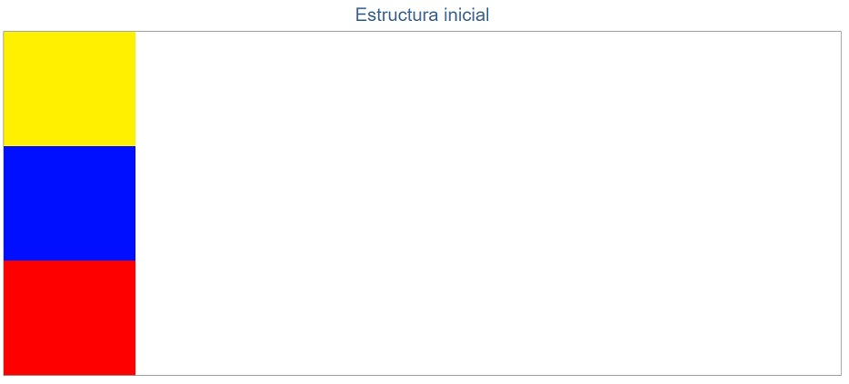
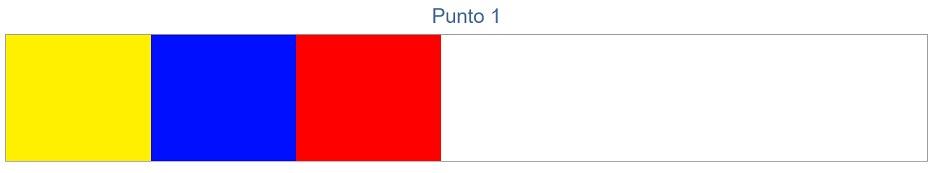
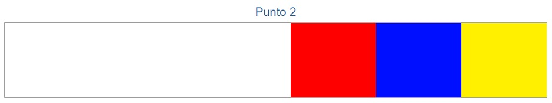

# La Bandera

## El proyecto
Este proyecto se divide en 3 ejercicios:
* Estructura inicial
* Punto 1
* Punto 2

## Ramas:
Tenemos 6 ramas en total:
#### master
Rama final del proyecto
#### gh-pages
Rama gh-pages para visualizar los ejercicios
#### consolidado
Rama donde se consolida las ramas estructura-inicial, punto-1 y punto-2, se realizan todos los cambios necesarios antes de subirlo a la rama master.
#### estructura-inicial
Rama donde se realiza solamente el primer ejercicio

#### punto-1
Rama donde se realiza solamente el segundo ejercicio

#### punto-2
Rama donde se realiza solamente el tercer ejercicio

## Desarrollado con:
`HTML` `CSS`

##  Créditos
* [Ruth Salvador](https://github.com/RuthSalvador)
